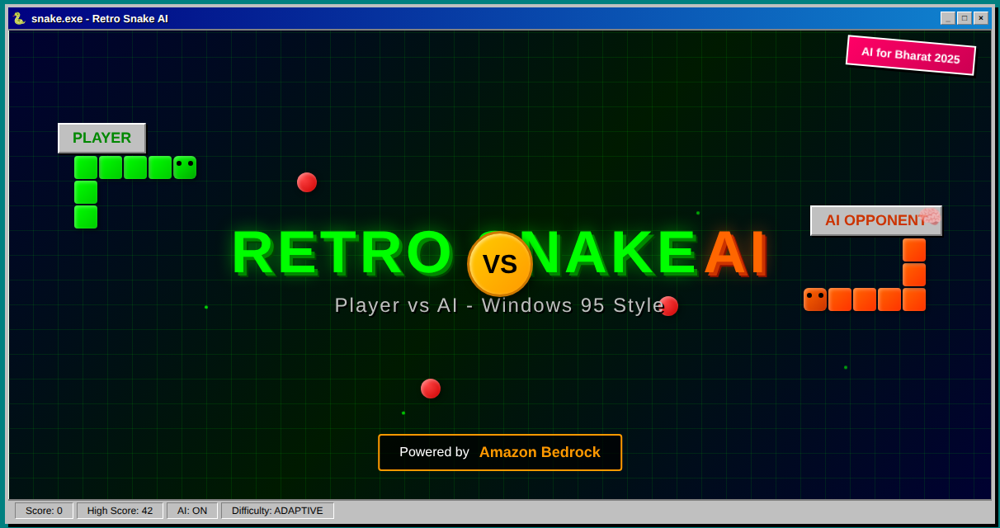

# 🐍 Retro Snake AI - Windows 95 Style



A nostalgic recreation of the classic Snake game with authentic Windows 95 styling and modern AI-powered enhancements using Amazon Bedrock, built for the **AI for Bharat Hackathon**.

[](https://brainupgrade-in.github.io/ai-for-bharat-retro-snake-game/)
[](https://builder.aws.com/content/36sd5VtfkqObcSjKf6nyCPk7ftN/bringing-classic-snake-into-the-ai-era-a-journey-with-amazon-bedrock)
[](https://pages.github.com/)
[](https://developer.mozilla.org/en-US/docs/Web/JavaScript)
[](https://aws.amazon.com/bedrock/)

## 🎯 Overview

Retro Snake AI combines the beloved classic Snake gameplay with an authentic Windows 95 aesthetic and cutting-edge AI technology. This browser-based game features pixel-perfect retro styling, complete with window chrome, menu systems, and the nostalgic gray color palette that defined 90s computing, enhanced with intelligent AI opponents and commentary powered by Amazon Bedrock.

**📖 Featured on AWS Builder Community**: Read the comprehensive blog post about this project on the [AWS Builder Community](https://builder.aws.com/content/36sd5VtfkqObcSjKf6nyCPk7ftN/bringing-classic-snake-into-the-ai-era-a-journey-with-amazon-bedrock), which details the journey of integrating Claude 3 Haiku into classic gaming.

### ✨ Key Features

#### 🎮 Core Gaming Experience
- **🖥️ Authentic Windows 95 UI** - Complete window frame, title bar, menu system, and status bar
- **🎮 Classic Snake Gameplay** - Grid-based movement, food collection, and collision detection
- **📊 Score System** - Real-time scoring with persistent high score storage
- **⌨️ Full Keyboard Controls** - Arrow keys, spacebar, pause, and restart functionality
- **📱 Responsive Design** - Works seamlessly on desktop and mobile devices
- **🔊 Retro Audio** - 8-bit sound effects generated with Web Audio API

#### 🤖 AI-Powered Enhancements
- **🧠 Intelligent AI Opponent** - Powered by Amazon Bedrock's Claude 3 Haiku for strategic gameplay
- **💬 Real-time AI Commentary** - Witty, contextual remarks during gameplay with 90s gaming humor
- **🔄 Smart Fallback System** - Advanced A* pathfinding algorithm ensures gameplay even offline
- **📈 Dynamic Difficulty Adjustment** - Adapts to player skill level for personalized challenge
- **⚡ Sub-500ms AI Response** - Lightning-fast AI decisions for smooth 60 FPS gameplay

#### 🛡️ Reliability & Accessibility
- **🌐 Universal Compatibility** - Works with or without AWS credentials
- **🧪 Property-Based Testing** - Comprehensive test suite ensuring game reliability
- **🎨 Retro Aesthetics** - MS Sans Serif fonts, beveled buttons, and classic color schemes

## 🤖 AI Features Setup (Optional)

The game works perfectly without any setup, but for the full AI experience with Claude 3 Haiku:

### AWS Bedrock Configuration
1. **Get AWS Credentials** with Amazon Bedrock access
2. **Open the game** and navigate to **Options → AWS Settings**
3. **Enter your credentials**:
   - **Region**: `ap-south-1` (or your preferred region)
   - **Access Key ID**: Your AWS access key
   - **Secret Access Key**: Your AWS secret key
4. **Click "Test"** to verify connection
5. **Enable AI features** in the Options menu:
   - **AI Opponent**: ON (for Claude 3 Haiku-powered opponent)
   - **Commentary**: ON (for AI-generated witty remarks)

### Required AWS Permissions
```json
{
    "Version": "2012-10-17",
    "Statement": [
        {
            "Effect": "Allow",
            "Action": ["bedrock:InvokeModel"],
            "Resource": ["arn:aws:bedrock:*::foundation-model/anthropic.claude-3-haiku-20240307-v1:0"]
        }
    ]
}
```

### Fallback AI System
- **No AWS setup needed** - The game includes an advanced A* pathfinding AI
- **Seamless experience** - Automatically switches between cloud and local AI
- **Always playable** - Full functionality regardless of internet connectivity

## 🎮 How to Play

### Controls
- **Arrow Keys** (↑↓←→) - Move the snake
- **SPACE** - Start the game
- **P** or **ESC** - Pause/Resume
- **R** - Restart after game over

### Objective
1. **Eat the red food** to grow your snake and increase your score
2. **Avoid walls** and your own body
3. **Achieve the highest score** possible!
4. Game speed increases as your snake grows longer

### Menu System
- **Game Menu** - New Game, Pause, Exit
- **Options Menu** - Sound and Difficulty settings (coming soon)
- **Help Menu** - Instructions and About information

## 🚀 Quick Start

### Play Online
**[🎮 Play the game instantly on GitHub Pages](https://brainupgrade-in.github.io/ai-for-bharat-retro-snake-game/)**

### Run Locally

1. **Clone the repository**
   ```bash
   git clone https://github.com/brainupgrade-in/ai-for-bharat-retro-snake-game.git
   cd ai-for-bharat-retro-snake-game
   ```

2. **Install dependencies**
   ```bash
   npm install
   ```

3. **Start development server**
   ```bash
   npm start
   ```

4. **Open your browser**
   Navigate to `http://localhost:8000`

### Build for Production

```bash
# Create production build
npm run build

# Serve production build locally
npm run serve:docs
```

## 🛠️ Technology Stack

### Core Technologies
- **JavaScript (ES6+)** - Modern vanilla JavaScript with modules
- **HTML5 Canvas API** - High-performance 2D rendering
- **CSS3** - Custom Windows 95 styling framework
- **Node.js** - Development tooling and testing

### Development Tools
- **Property-Based Testing** - Using `fast-check` for comprehensive test coverage
- **ES6 Modules** - Clean, modular code architecture
- **Custom Build System** - Optimized production builds for GitHub Pages

### Browser Support
| Browser | Version |
|---------|---------|
| Chrome | 90+ |
| Firefox | 88+ |
| Safari | 14+ |
| Edge | 90+ |

## 📁 Project Structure

```
retro-snake-ai/
├── 📄 index.html              # Main game entry point
├── 📁 css/
│   ├── win95.css              # Windows 95 UI framework
│   └── game.css               # Game-specific styles
├── 📁 js/
│   ├── main.js                # Application initialization
│   ├── config.js              # Game configuration constants
│   ├── game.js                # Core game engine
│   ├── snake.js               # Snake entity logic
│   ├── food.js                # Food spawning system
│   └── *.test.js              # Property-based tests
├── 📁 docs/                   # Production build output (GitHub Pages)
├── 📁 .kiro/                  # Development specifications
│   ├── specs/snake-game/      # Feature specifications
│   └── steering/              # Project guidelines
├── 🔧 build.js                # Production build script
├── 📦 package.json            # Dependencies and scripts
└── 📖 README.md               # This file
```

## 🧪 Testing

The project includes comprehensive property-based testing to ensure game reliability:

```bash
# Run all tests
npm test

# Run tests in watch mode
npm run test:watch
```

### Test Coverage
- **Snake Movement** - Validates continuous movement and direction changes
- **Collision Detection** - Tests wall, food, and self-collision scenarios
- **Game State Management** - Verifies state transitions and game flow
- **Score System** - Ensures accurate scoring and persistence
- **Food Spawning** - Tests random positioning and collision avoidance

## 🎨 Design Philosophy

### Windows 95 Authenticity
- **Color Palette** - Classic `#C0C0C0` gray with navy blue accents
- **Typography** - MS Sans Serif font family for authentic feel
- **UI Elements** - Beveled buttons, inset panels, and outset borders
- **Window Chrome** - Complete title bar with minimize/maximize/close buttons
- **Menu System** - Dropdown menus with hover states and separators

### Modern Development Practices
- **ES6 Modules** - Clean separation of concerns
- **Property-Based Testing** - Comprehensive test coverage
- **Responsive Design** - Adapts to different screen sizes
- **Performance Optimization** - 60 FPS game loop with efficient rendering

## 🚀 Deployment

### GitHub Pages Setup

1. **Push your code** to GitHub
2. **Go to repository Settings** → Pages
3. **Set source** to "Deploy from a branch"
4. **Select** "main" branch and "/docs" folder
5. **Save** and wait for deployment

The game will be available at: `https://brainupgrade-in.github.io/ai-for-bharat-retro-snake-game/`

### Manual Deployment

The `docs/` folder contains a complete, optimized build ready for any static hosting service:
- Netlify
- Vercel
- AWS S3 + CloudFront
- Any web server

## 🎯 Future Enhancements

### Completed AI Features ✅
- **🤖 AI Opponent Snake** - Fully implemented with Claude 3 Haiku via Amazon Bedrock
- **💬 AI Commentary** - Real-time witty game commentary with 90s gaming references
- **📈 Dynamic Difficulty** - Adaptive gameplay that learns from player performance
- **🔊 Sound Effects** - Complete retro 8-bit audio system with Web Audio API
- **🔄 Fallback AI** - Advanced A* pathfinding for offline/universal gameplay

### Future Enhancements 🚀
- **👥 Multiplayer Mode** - Real-time competition with AI commentary
- **🏆 Tournament System** - Bracket-style competitions with intelligent matchmaking
- **🎭 AI Personalities** - Different AI opponents with unique playing styles
- **🗣️ Voice Commentary** - Text-to-speech integration for audio commentary

### Technical Roadmap
- WebGL rendering for enhanced performance
- Mobile touch controls
- Multiplayer support
- Custom themes and skins
- Leaderboard system

## 🏆 AI for Bharat Hackathon

This project was created for the **AI for Bharat Hackathon** to demonstrate:
- **AI Integration in Gaming** - Practical implementation of Amazon Bedrock in real-time applications
- **Intelligent Fallback Systems** - Ensuring universal accessibility with A* pathfinding algorithms
- **Modern web development** with vanilla JavaScript and AI services
- **Retro gaming aesthetics** enhanced with contemporary AI technology
- **Property-based testing** for reliable AI-dependent software
- **Clean architecture** supporting both cloud and local AI systems
- **Production deployment** with comprehensive AI functionality

### 🎖️ Project Recognition
- **Featured on AWS Builder Community** - [Read the full blog post](https://builder.aws.com/content/36sd5VtfkqObcSjKf6nyCPk7ftN/bringing-classic-snake-into-the-ai-era-a-journey-with-amazon-bedrock)
- **Complete AI Implementation** - Fully functional Claude 3 Haiku integration
- **Open Source Example** - Demonstrates practical AI gaming patterns for the community

## 🤝 Contributing

Contributions are welcome! Please feel free to submit issues and pull requests.

### Development Setup
1. Fork the repository
2. Create a feature branch: `git checkout -b feature-name`
3. Make your changes and add tests
4. Run tests: `npm test`
5. Build and test: `npm run build`
6. Submit a pull request

## 📄 License

This project is licensed under the ISC License - see the [LICENSE](LICENSE) file for details.

## 🙏 Acknowledgments

- **AI for Bharat Hackathon** - For the inspiration and platform
- **Windows 95** - For the timeless UI design that still brings joy
- **Classic Snake Game** - For decades of simple, addictive gameplay
- **Modern Web Standards** - For making retro aesthetics possible in browsers

---

**🎮 [Play the game now!](https://brainupgrade-in.github.io/ai-for-bharat-retro-snake-game/) | 🐍 Built with ❤️ for retro gaming enthusiasts**